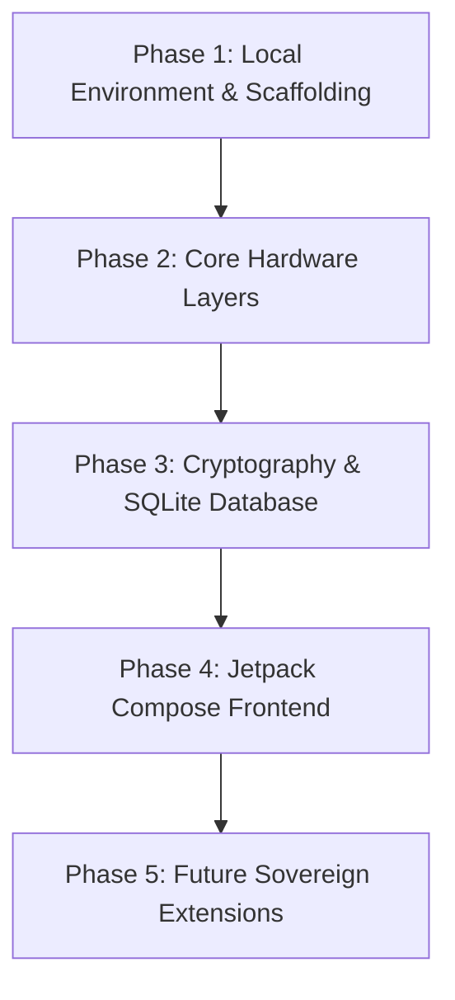

# Sovereign Mesh Project Roadmap

This document outlines the milestones and engineering roadmap for the Sovereign Mesh Android client. Our focus is strictly local, zero-telemetry, off-grid communication.

---

## 🗺️ Chronological Build Phases

---

### Phase 1: Local Environment & Scaffolding
* **Objective:** Establish the foundation of the Android project with strict compilation parameters and verified open-source dependencies.
* **Key Tasks:**
  * Configure the Gradle build matrix (`build.gradle.kts` files) with explicit compiler flags ensuring reproducible compilation.
  * Integrate the JavaLite protobuf pipeline (`com.google.protobuf:protobuf-javalite`) to handle local serialization.
  * Initialize the asset pipelines for Meshtastic schemas (importing `.proto` definitions).
  * Integrate [OSMDroid](https://github.com/osmdroid/osmdroid) for completely offline, peer-to-peer visual map rendering (using offline map tiles).

---

### Phase 2: Core Hardware Layers
* **Objective:** Build background services to manage direct node connectivity without relying on external system engines or proprietary services.
* **Key Tasks:**
  * Create a persistent foreground Android Service (`MeshHardwareService`) to hold hardware state.
  * **USB-OTG Serial Driver:** Implement raw byte stream reading and writing using `android.hardware.usb.UsbManager` and bulk endpoints.
  * **Bluetooth Low Energy (BLE) Client:** Implement asynchronous BLE discovery, connection, service discovery, MTU negotiation, and characteristic notify/write operations.
  * **SLIP Framer:** Design a local Serial Line Internet Protocol (SLIP) encoder/decoder layer to process incoming packet streams into raw protobuf payloads.

---

### Phase 3: Message Cryptography & Database
* **Objective:** Ensure all communication records remain encrypted at rest on the client device and are only readable by authorized keys.
* **Key Tasks:**
  * Design a local SQLite database schema (via Room or raw SQLite APIs) to cache channel metadata and decrypted packet logs.
  * Configure database-level encryption (SQLCipher) to prevent forensic memory dumps from extracting message contents.
  * Implement local cryptographic keys manager using the Android Keystore system.
  * Write the channel-key decryption logic, matching packets to symmetric keys (e.g., standard Meshtastic AES-128 / AES-256 channel encryption).

---

### Phase 4: Jetpack Compose Frontend
* **Objective:** Provide a highly transparent, intuitive, and responsive user interface emphasizing cryptographic status and operational state.
* **Key Tasks:**
  * **Sovereign Dashboard:** High-contrast design showcasing current node connectivity status (USB/BLE), battery percentage, signal quality (RSSI), and unread indicators.
  * **Cryptographic Indicators:** Visually distinct labels confirming message encryption levels (e.g., "Encrypted: AES-256", "Public Channel", "Signature Validated").
  * **Offline Map UI:** Integrate the OSMDroid map view showing local mesh nodes, message location beacons, and direct offline routing helpers.
  * **Aesthetic Theme:** Dark-mode primary UI optimized for night operations, tactical legibility, and minimal battery drainage.

---

### Phase 5: Future Sovereign Extensions (Feature Horizon)
* **Objective:** Implement advanced counter-forensic and air-gapped utility extensions.
* **Planned Capabilities:**
  1. **Air-Gapped Text-to-Speech Engine:** Utilize a completely offline Android Text-to-Speech engine (`android.speech.tts.TextToSpeech`) to read critical or emergency broadcast mesh alerts out loud, ensuring visual impairment doesn't impede safety, while completely blocking any external voice processing networks.
  2. **Proximity-Based Steganographic Hiding:** An advanced security utility to hide received message payloads dynamically inside innocent-looking local image files (PNG/JPG) using LSB (Least Significant Bit) steganography, allowing private local backup/transport of messages on the device's shared disk storage.
  3. **Automated Network Integrity Mapping:** Passive diagnostic tools to trace and log RF signal attenuation rates over time based solely on locally received node packets (RSSI, SNR), outputting offline-viewable performance matrices and heatmap overlays.
